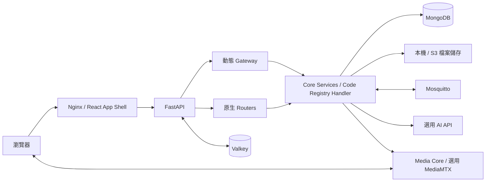

# LaFenice 核心系統架構

本摘要於 2026-09-12 依專案的《系統架構說明.md》、目前原始碼與元件文件整理。描述 Core 平台，不假設任何額外業務 Plugin 已安裝；部署參數與實際啟用服務仍依目標環境確認。

按問題閱讀：整體關係見 §1；畫面與 API 見 §2；動態程式與 Plugin 見 §3；資料與租戶見 §4；背景服務與媒體見 §5；部署見 §6；原始碼定位見 §7。

## 1. 平台定位與元件

LaFenice 是設定驅動、可在執行期間擴充的 Web 平台。React App Shell 提供共同介面；FastAPI 提供原生功能與動態 Gateway；MongoDB 保存設定、版本與業務資料。Plugin 將相關設定和程式組成可轉移的功能封裝。

| 元件 | 主要責任與保存內容 |
| --- | --- |
| React、TypeScript、Vite | App Shell、登入、管理頁、選單、主題、語系與動態 HTML 容器。 |
| Nginx | 編譯後靜態資產、SPA 路由回退與部署入口相關設定。 |
| FastAPI / Uvicorn | 啟停生命週期、原生 HTTP / WebSocket 路由、Gateway 與背景服務。 |
| MongoDB Replica Set | 設定、帳號、Code Registry 版本、MDC、業務資料、執行紀錄及檔案中繼資料的主要持久化來源。 |
| Valkey | 設定與驗證版本通知、排程喚醒、Leader Lock 等跨執行個體協調。 |
| 本機磁碟或 S3 相容儲存 | File API 管理的檔案內容；與 MongoDB 中繼資料分離。 |
| Mosquitto | MQTT Broker、Dynamic Security 與 Listener 訊息來源。 |

## 2. 畫面、請求與授權

### App Shell

`App.tsx` 組合登入狀態、網站設定、Access Control 選單與頁面容器。原生管理頁由 React 提供；Code Registry HTML 經 Gateway 回傳後由 iframe 顯示，不必重新編譯 Frontend。

Shell 向動態頁面提供 API Base、access token、角色、語系、Language Pack 與主題等 runtime context。完整 context 經限定來源的 `postMessage` 傳送；非敏感顯示資訊可放在 fragment。Plugin 開發應遵循動態頁面契約，不自行從瀏覽器 storage 抽取 token。租戶切換後的 token / context 更新亦需反映到頁面資料。

### API 路徑

主要 HTTP API prefix 是 `/{PROJECT_ROOT}/api`，預設 `/lafenice/api`；`main.py` 將 `/api` 開頭的請求正規化至目前 project root。WebSocket 有各自的原生路徑，例如 `/{PROJECT_ROOT}/ws/frontend-events`，不要一律加上 `/api`。

請求分兩類：

- 原生 Router：Code Registry 管理、Gateway 維護、Plugin 封裝、檔案串流、媒體與 WebSocket 等功能。
- 動態 Gateway：依 endpoint 與 HTTP method 尋找 MongoDB 保存的設定，驗證呼叫者，載入 `services.*` Handler，再統一回應。Handler 可為 Core Service 或物化的動態 Python 程式。

Gateway 常用方法為 `GET`、`POST`、`PATCH`、`DELETE`。Handler 接收 `method, query_params, resource_id, payload, header, uid, roles` 等統一關鍵字參數。身分及租戶 context 由伺服器建立，不信任業務 payload 自填的角色或租戶。

### 分層安全邊界

登入使用 RSA-OAEP/SHA-256 密碼傳輸與 bcrypt 雜湊驗證；連線仍需 HTTPS。Access Token 是 JWT，Refresh Token 輪替且只持久化其 hash。帳號版本變更透過 Valkey 通知各 Backend，讓記憶體中的驗證版本更新。

選單可見性、Gateway 驗證、Service 動作授權、MDC collection / field / relation 權限、租戶範圍及檔案授權是不同層次。隱藏選單不等於 API 已受保護。API Key 的可用性依路由設定，其角色來自 owner，租戶綁定另依 Key 契約；不要推論 Key 與互動式 JWT 可操作所有相同功能。

## 3. 動態程式、MDC 與 Plugin

### Code Registry

MongoDB 保存 module 與 version，Backend 將目前版本物化供執行：

| code type | 執行或服務方式 |
| --- | --- |
| `py` | `services/generated/` 內可由 Gateway 載入的 Python Handler。 |
| `html` | `services/generated_html/` 包裝的 GET 頁面，可連結 App Shell 選單。 |
| `css` / `js` | `services/generated_assets/` 提供對應 MIME type 的資產。 |
| `others` | 保存及版本管理，不自動成為可執行路由。 |

物化檔案是執行產物；主要版本來源在 MongoDB。儲存新版本會影響目前使用的內容，不應將 version test 視為隔離的發布階段。Gateway 設定更新會藉由 Valkey 通知其他 Backend 重讀及重新載入。`api_gateway.json` 是種子設定，不是執行期唯一真實來源。

Python 語法、Handler 介面和禁止 import 檢查只是護欄，不能描述成完整的任意程式碼 sandbox。

### MDC

MDC metadata 描述欄位、驗證、權限、關聯、清單呈現及租戶模式。Generate Code 結合 metadata 與 code templates，產生 CRUD / history API、HTML 頁、Code Registry 版本、Gateway 路由和相關選單、語系資源。

生成結果可再客製，但重新 Generate Code 可能以新版本取代現有客製。一般資料操作透過 `ApiController` 與 `mongo_access` 處理驗證、歷程和租戶範圍；直接繞過這些入口不能推論保有相同保障。

### Core / Plugin 分工

Core 提供登入、路由、執行、MDC、儲存、排程、媒體等共用能力。業務 Plugin 使用這些能力實作特定產品功能，以一致的 `plugin` 身分標記所屬資源。

匯出包含選取的 collection metadata、code module / latest version、Gateway routes、menu、roles、Language Pack、schedulers、App Env。它不是整個系統備份：不包含使用者、業務 records、上傳檔案 bytes 或 scheduler run logs；App Env 值預設遮蔽。匯入會檢查封裝、校驗碼與衝突，並將資源套用到平台。實際 API 操作依 `transfer-lafenice-plugin` 契約。

## 4. 資料與全域租戶

Tenant 是跨 Plugin 的全域 workspace，不屬於單一 Plugin。使用者可有多個 `tenant_ids`，同一 authenticated session 最多一個 `active_tenant_id`。Collection 的 `plugin` 用來識別功能歸屬，不是租戶授權範圍。

- `tenant_mode: legacy` 保留不做租戶範圍限制的舊行為。
- `tenant_mode: required` 要求有效 active tenant，並對支援的主資料、歷程、reference 與关联 File API 紀錄套用隔離。
- `tenant_id` 是伺服器管理欄位，不能由 query / body 自行選擇。
- `super` 可以選擇租戶，但不免除 required collection 的 active tenant 要求；collection 與欄位角色仍分別檢查。

正常流程為 Gateway 驗證 → 綁定伺服器 request context → `ApiController` / tenant-aware `mongo_access` 解析 collection 設定 → 限制查詢並注入寫入的 tenant id。

經標準 Gateway 且使用平台 scoped helpers 的既有生成程式可繼承核心隔離，不應僅為啟用租戶就一律重新生成。Raw Mongo、複製的 helper 或背景執行不一定具有相同 context，需另查契約。啟用 required 後不可退回 legacy 或變更 collection 的 plugin。

File API 將中繼資料與內容分離；檔案下載需依可見性、權限及適用的租戶規則處理。MongoDB 備份不等於已備份檔案或媒體錄影內容。

## 5. 背景服務、事件、AI 與媒體

| 子系統 | 流程與邊界 |
| --- | --- |
| Scheduler | MongoDB 保存定義與 run；Valkey Leader Lock 協調到期掃描，MongoDB 原子更新取得工作執行權。以 `method=SCHEDULE` 呼叫 Handler，不等同一般 HTTP request context。 |
| MQTT Listener | 由 Listener Manager 管理長期訂閱，訊息以 `method=MQTT` 派送 Handler；不使用 Scheduler 永久迴圈維持訂閱。 |
| Dev Messages | 原生 WebSocket 即時診斷訊息，僅作用於目前 Backend process 的連線，不是持久化稽核。 |
| Frontend Events | 原生 WebSocket 推送 topic / payload；目前為 process 內廣播、無連線則丟棄，不能推論具跨 Backend 傳遞、持久化或逐租戶投遞保證。 |
| 平台 AI Agent | Core 載入 Agent、指定 Skill 與允許的 Tool，呼叫外部 AI API，檢查工具白名單後經設定的 Gateway POST 執行工具。這裡的資料庫 Skill / Tool 與本目錄供 Codex 使用的 `SKILL.md` 是不同機制。 |

Media Core 是原生媒體能力：保存來源與錄影索引、處理 action ACL 與短效 media session，透過 MediaMTX provider 管理串流和錄影。瀏覽器使用 SDK 進行 WHEP live 與授權 playback；媒體內容傳輸與一般 JSON API 是不同路徑。

目前媒體來源為全站共用，不要求 active tenant，以 source action ACL 與管理角色授權；舊來源的 tenant 欄位保留相容用途，不能套用 MDC required 的假設。實際環境應以 `/media/capabilities` 判斷版本能力。Plugin 保存 `media_source_id`，由 Core 管理 RTSP 憑證、provider 和實體錄影位置。攝影機業務 CRUD 或監控頁面屬於 Plugin，不能視為 Core 已提供的完整產品。

## 6. 啟動與部署

`main.py` 啟動帳號版本 Listener、Code Registry 還原與錯誤索引、MQTT Listener、Gateway 設定 Listener、預設帳號和系統設定、Media Core 及 Scheduler。停止時清理背景服務。啟動遇到 MongoDB / Valkey 相依錯誤時清理已啟動服務並報錯。

專案包含 Dev / Stage / Production Compose、`packaging/` 發行流程與 `zeabur/` 部署資料。Compose 的 MongoDB Replica Set、Valkey、Mosquitto、選用物件儲存及 MediaMTX 是參考配置，不能視為每個部署都啟用所有項目，也不能因為有 Replica Set 就直接宣稱具完整高可用性。

多 Backend 共用 MongoDB 的持久狀態與 Valkey 協調；process 內快取、WebSocket 連線和動態程式物化檔案仍各自存在。檔案儲存必須讓提供下載的 Backend 能取得內容，通常需共用 S3 相容儲存。媒體錄影儲存另由 MediaMTX 配置管理。

## 7. 原始碼與文件索引

以下為專案根目錄相對路徑，僅供持有原始碼時定位；本 reference 已包含獨立說明所需摘要。無原始碼時不要求取得這些檔案，也不把原始碼內部入口當成部署 API 契約。

| 主題 | 來源 |
| --- | --- |
| 原始架構與部署 | `系統架構說明.md`、`運行說明.md`、`LaFeniceBackend/docker-compose*.yml`、`packaging/README.md`、`zeabur/README.zh-TW.md` |
| 啟停與 Router 掛載 | `LaFeniceBackend/main.py` |
| App Shell / runtime | `LaFeniceFrontend/src/App.tsx`、`src/auth/`、`src/config/`（後兩者相對於 `LaFeniceFrontend/`） |
| Gateway | `LaFeniceBackend/gateway/router.py`、`LaFeniceBackend/docs/api_gateway.md` |
| Code Registry / MDC | `LaFeniceBackend/services/code_registry.py`、`LaFeniceBackend/services/collection_config.py`、`LaFeniceBackend/code_templates/`、`LaFeniceBackend/docs/collection_generate_code.md` |
| 資料與租戶 | `LaFeniceBackend/services/api_controller.py`、`LaFeniceBackend/mongo_access.py`、`LaFeniceBackend/services/tenants.py`、`LaFeniceBackend/docs/multi_tenancy.md` |
| 認證 / 檔案 | `LaFeniceBackend/services/auth.py`、`LaFeniceBackend/services/files.py`、`LaFeniceBackend/docs/api_key_auth.md` |
| Plugin 轉移 | `LaFeniceBackend/services/plugin_export.py`、`LaFeniceBackend/docs/plugin_export.md`、`LaFeniceBackend/docs/plugin_import.md` |
| 背景與 AI | `LaFeniceBackend/services/scheduler.py`、`LaFeniceBackend/services/mqtt_listeners.py`、`LaFeniceBackend/services/agents.py`、`LaFeniceBackend/docs/agent_management.md` |
| 即時事件 | `LaFeniceBackend/services/frontend_events.py`、`LaFeniceBackend/docs/frontend_events.md`、`LaFeniceBackend/services/dev_messages.py` |
| 媒體 | `LaFeniceBackend/services/media_core/`、`LaFeniceBackend/docs/media-core.md` |
